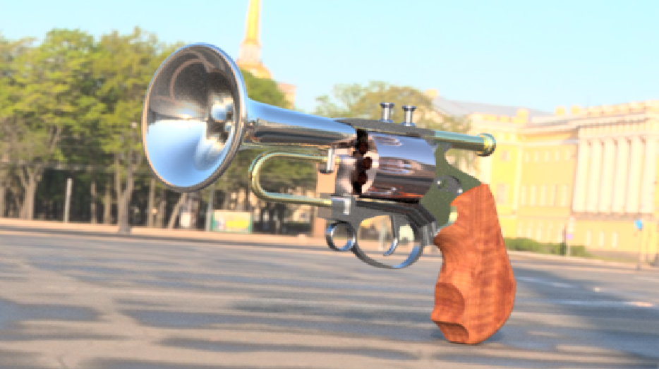
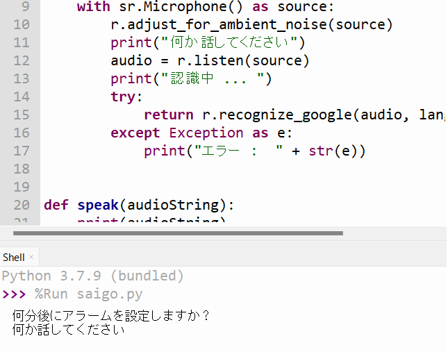
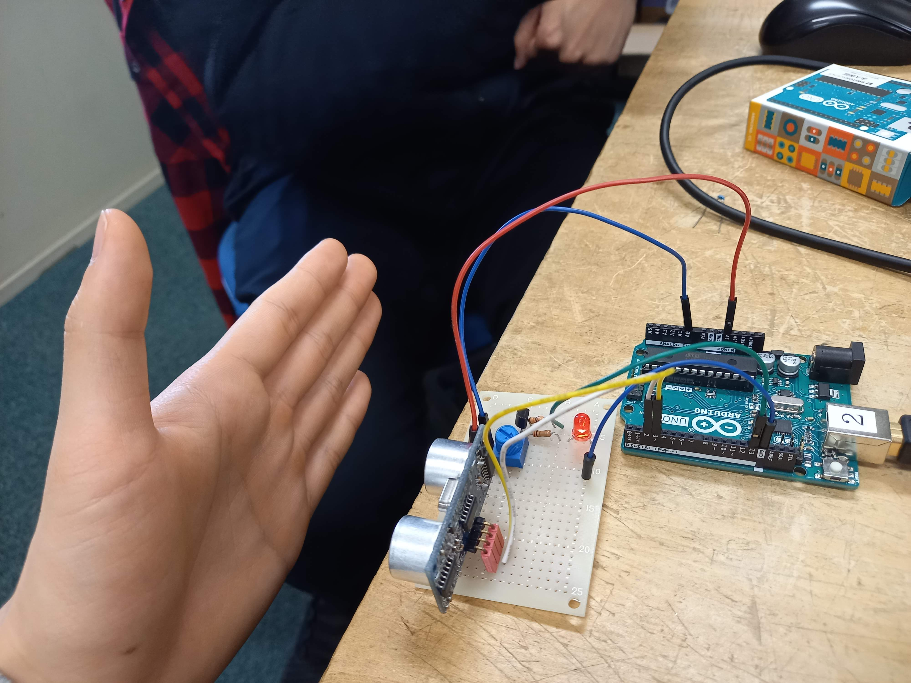

#専門学校冒険記録
##専門学校に入ってからの冒険の記録。
        <div class="image-container fade-in">
##3Dcadの巻
          
###作品名<br>ラッパ銃
          <p>fusion360で作った渾身の一作。</p>
        </div>
      </div>
            <h2>プログラムの巻</h2>
          
          <h5>作品名<br>五分後起こして</h5>
          <p>音声認識、出力、の機能があり、話した言葉をそのまま指定時間に返してくるアラーム。<br>忘れそうなことの一時的なメモにも使える。</p>
        </div>
      </div>
          <h2>電子回路の巻</h2>
          
          <h5>作品名<br>近づくとヒカル</h5>
          <p>超音波距離センサを用いてLEDを制御している。<br>この扱いを活かして現在、視覚障がい者支援デバイスの開発に取り組んでいる。</p>
        </div>
      </div>
    </div>
          <h2>川上大心のステータス</h2>
          <h6>ビジネス情報部門～情報処理検定2級<br>全商簿記2級<br>珠算・電卓実務検定試験１級<br>その他三級いくつか<br>高校時代バレー部部長経験有り<br>老舗焼肉屋で約五年アルバイト、アルバイトリーダー経験有り</h6>
  </div>

          
  </body>
  </html>
          ```
